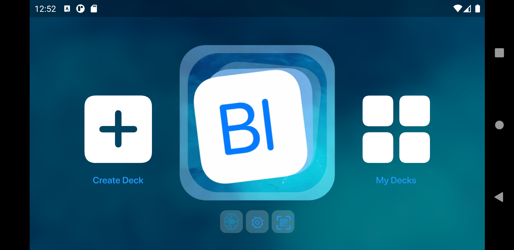
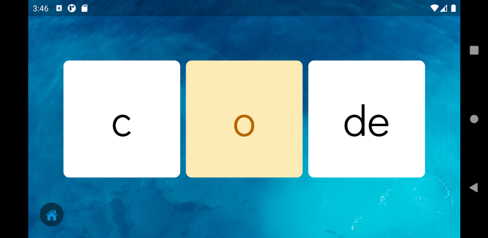
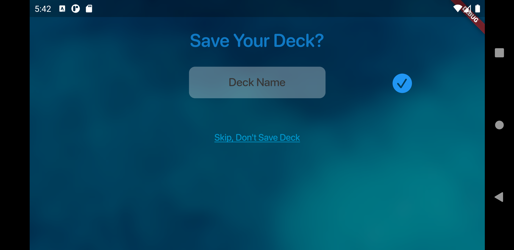
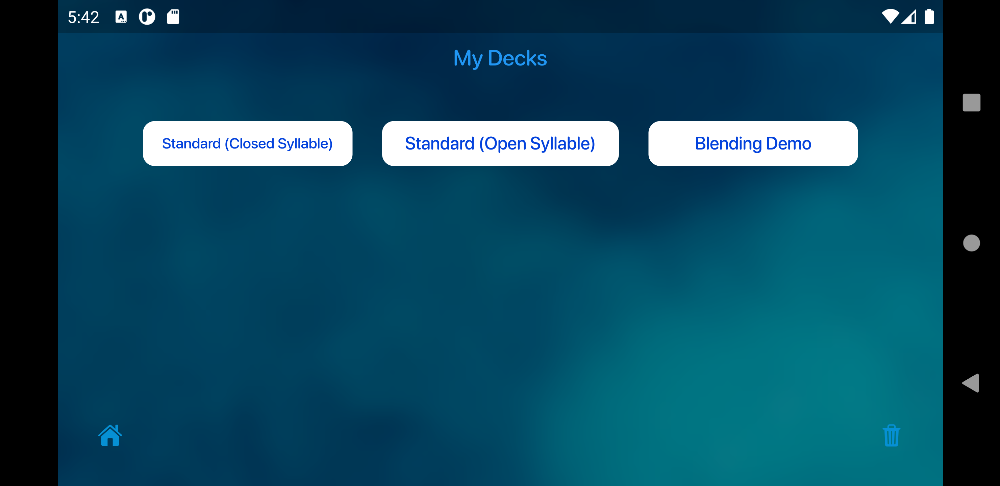
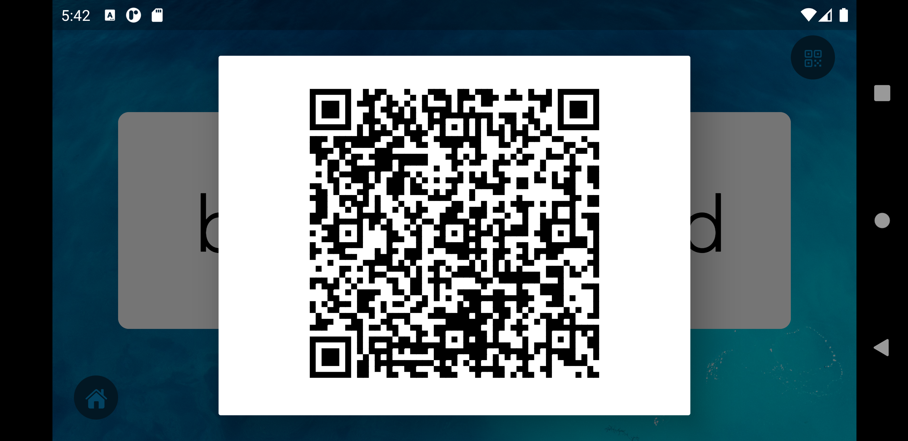

# Blending Board
Source code for the Android and Windows version of Blending Board, an app that helps dyslexics learn how to read. This project was done in collaboration with Technology Integration Specialist Nadine Gilkison and iOS app creator Brayden Gogis.

Google Play Store: https://play.google.com/store/apps/details?id=com.flutter_android.blendingboardapp&hl=en_US&gl=US

Windows App Store: https://apps.microsoft.com/detail/9pnwhb4xdwsl?hl=en-US&gl=US

## **Introduction**
Blending Board is a digital educational tool that helps students with dyslexia sound out syllables and improve reading. Users of the app can create customized digital cards which contain letters that form specific sounds in English. Learners can then flip through their set of cards to practice blending sounds together to create words. This project was created during the pandemic to help students and teachers use blending boards while learning at home. 

## **Description & Main Features**
To build the Android version of this app, I used Flutter, which is a software development kit made by Google and runs on the coding language, Dart.

The homescreen allows users to access the main functions of the app, such as creating and viewing decks and accessing settings. Clicking the Blending Board icon brings users to their last used deck.

On the board screen, users can flip through decks by pressing cards to move to the next letter. They also have the ability to shuffle the cards.

Users can create decks by choosing specific letter sets for the beginning, middle, and end cards. 
.png)

Users can customize individual letter sets by adding or removing cards to the original letter set.
.png)

Created decks have the option to be saved. Saved decks will appear in the “My Decks” screen.

To share decks across devices, each deck has a QR code that can be scanned, transferring the letter deck information across devices.

## **Authors and Acknowledgment**

Blending Board (Android and Windows Ver) was created by **[Natalie Leung](https://github.com/polarcow)**.

This project was made possible by:

- **[Nadine Gilkison](https://x.com/nadinegilkison)**
- **[Brayden Gogis](https://x.com/ChainReactGames)**
  
## **Changelog**

- **1.0.0:** Initial release
- **1.0.1:** QR & Letter Customization Update
- **1.0.2:** Multi-Select Update
- **1.0.2:** Bug Fixes

